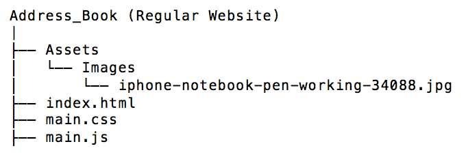

# Address Book Version 2 - Progressive Web App

### Introduction

The script in this repository represents a modified version of the
Address-Book-Project / Contact Management System; the links to the 
original version is provided at the end of the paragraph. The simple 
address book website was converted into a progressive web application
(PWA).  

The address book's code allows changes to get automatically 
saved in your browser. Meaning that any added / deleted person(s), or 
modifications done to elements within your address book will remain
after refreshing or closing your browser. Please note that your initial
contacts are fictional characters that were included by default.

1. Github Repository (original version): https://github.com/Juan-Moctezuma/Address-Book-Project
2. Github Page (Original version): https://juan-moctezuma.github.io/Address-Book-Project/

### What is a PWA?
It's a web app that will not crash if there's no internet access. Anyhow, 
features that rely completely on the network will not be available.
PWA are able to load fetched data when there is no network, sync in the background 
and seamlessly do things while providing a native-like experience for users.

### What is the difference between the original version and the PWA?
Their functionality is identical, however the PWA will open and load without
internet / wi-fi. The original version depends entirely on the network.

### PWA's folder structure vs. Static / Vanilla JS website's architecture

#### Version 1 - Original

#### Version 2 - PWA 

### What command lines are required after setting up the files (Case in which the app was previously a static website)?

`npm init -y`

`npm install express body-parser`

If you are on Mac, use terminal and type the previous command; but first 
make sure you are in the correct directory (the folder containing your project).
Node_modules, package-lock.json & package.json will get created after running 
the previous commands.

### Does the code require a local web server to run?
Yes, but only once; afterwards you can simply visit your your local host on Google 
Chrome and your script should be able to run with or without internet connection.

If you decide to run this code, be sure to use the following link
in order to view the app: http://localhost:1779/public/

Please note that you don't need to use port 1779, you can change it
on the server.js file.

### Technologies

1. HTML5
2. CSS3
   * Responsive Framework: Bootstrap 4
3. JavaScript
   * ES6
   * jQuery
   * JSON
   * Regular Expressions (used for: Form-Validation)
4. Node.js
   * Web Application Framework: Express.js
   * Body-Parser (middleware)
5. Python 2 (via Live/local Server)
